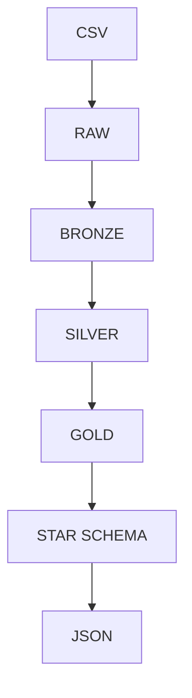
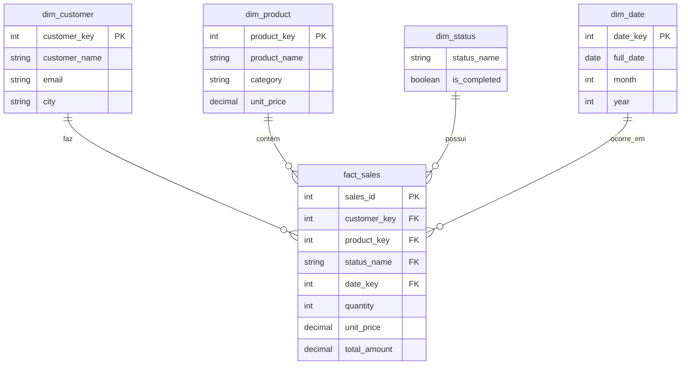

# Engenharia de Dados com Databricks e PySpark

Pipeline completo utilizando arquitetura Medalhão (Raw → Bronze → Silver → Gold), modelagem Star Schema e geração de JSON analítico com PySpark e Spark SQL.

# Arquitetura



## Tecnologias

- Databricks
- Apache Spark
- PySpark
- Spark SQL
- Delta Lake
- Python

## Objetivo

Desenvolver um pipeline de dados utilizando arquitetura Medalhão.

O pipeline realiza:

- ingestão de dados CSV
- tratamento e padronização
- validação de qualidade
- modelagem dimensional
- geração de JSON analítico

## Arquitetura Medalhão

### Raw

Armazena o arquivo original.

### Bronze

Estrutura os dados mantendo fidelidade ao arquivo de origem.

### Silver

Realiza limpeza, tipagem, padronização e validações.

### Gold

Disponibiliza modelo Star Schema para consumo analítico.

## Modelagem 


## Data Quality

Foram implementadas validações para:

- valores nulos
- quantidade negativa
- normalização de países
- normalização de datas
- remoção de duplicidades

## Consulta Final 

A solução foi desenvolvida utilizando:

- Spark SQL
- PySpark

## Resultado
```json
{
  "data": [
    {
      "Country": "USA",
      "Sales": [
        {
          "ProductLine": "Classic Cars",
          "QuantityOrdered": "120",
          "Sales": "14500.50"
        }
      ]
    }
  ]
}
```


